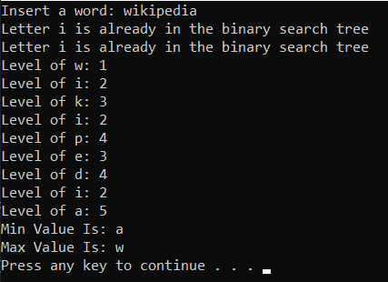

# Visual-Representation-Of-Binary_Search_Tree-Levels
This is a C project in which the user enters a word and with the help of a binary search tree the program finds and shows the level of each letter,
the minimum letter and the maximum letter.

First of all, the user inserts a word. Then a binary search tree (BST) will be created and after that each of the letters of the word 
will get inserted in the tree. If a letter is already in the tree, then a message saying that the letter is already in the BST will be shown.

Then there will be a series of messages showing the level of each letter.

After all these messages, the user will see 2 more messages. 

One of them will show which letter is the minimum and the other one 
will show which letter is the maximum (Alphbetical order not minimum/maximum level of the letter in the tree). 

E.g. If the word is wikipedia:

